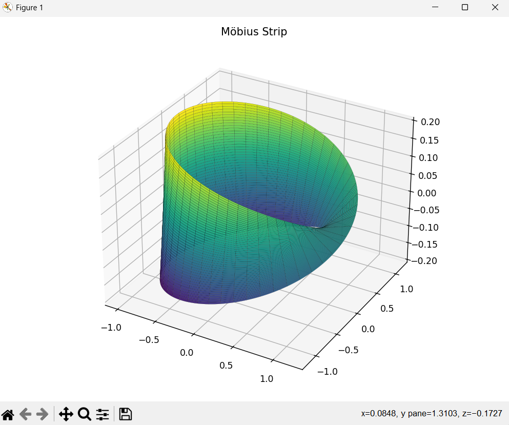

# Möbius Strip Project 🌐

This project visualizes and calculates properties of a **Möbius Strip** using Python. It includes:
- 3D visualization with `matplotlib`
- Calculation of surface area
- Edge length computation using `scipy`

---

## 📸 Output Screenshot

> Example output from the program:



---

## 🚀 Features

- Parametric equations to model the Möbius strip
- Surface area integration
- Edge length calculation
- Interactive 3D plot

---

## 🧠 Technologies Used

- Python
- NumPy
- SciPy
- Matplotlib (3D Plotting)

---

## 🧪 How to Run

### 1. Clone this repository:
```bash
git clone https://github.com/yourusername/mobius-strip-project.git
cd mobius-strip-project

2. Install dependencies:
bash
Copy
Edit
pip install numpy scipy matplotlib

3. Run the script:
bash
Copy
Edit
python mobius_strip.py

🙋‍♀️ About Me
Hi! I'm Sneha Latha, a final-year Computer Science student passionate about math, programming, and visual learning. I built this project as part of my learning journey to explore mathematical beauty through technology.

